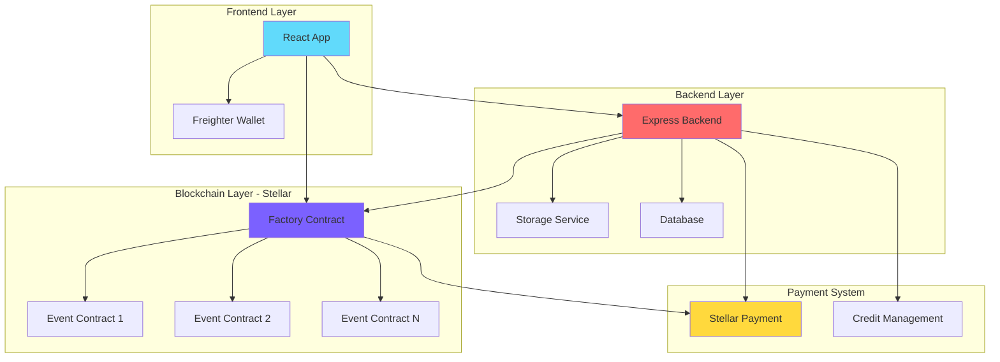
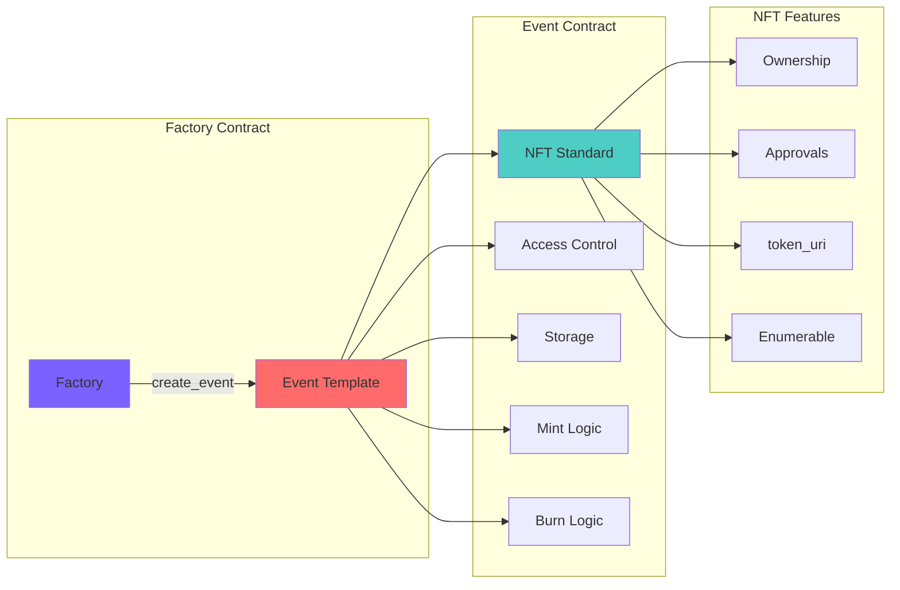
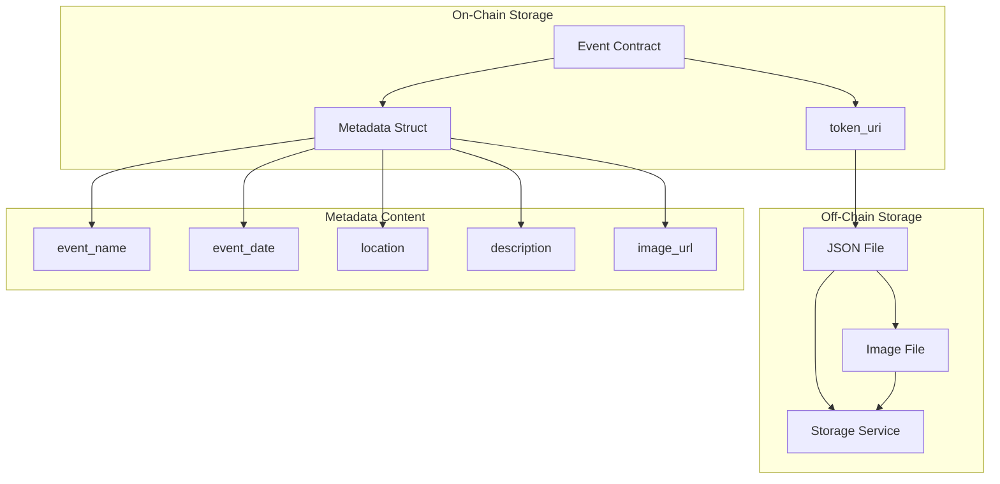
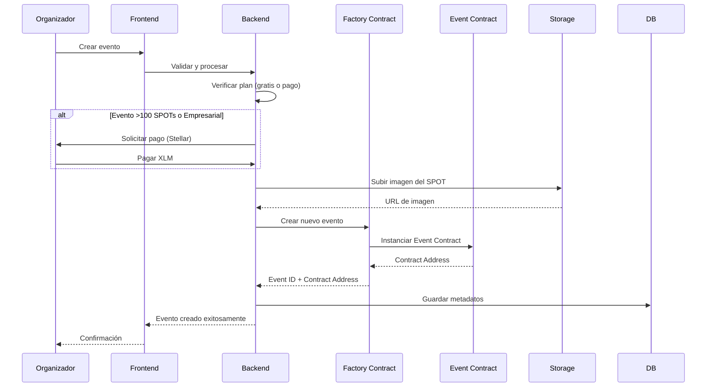
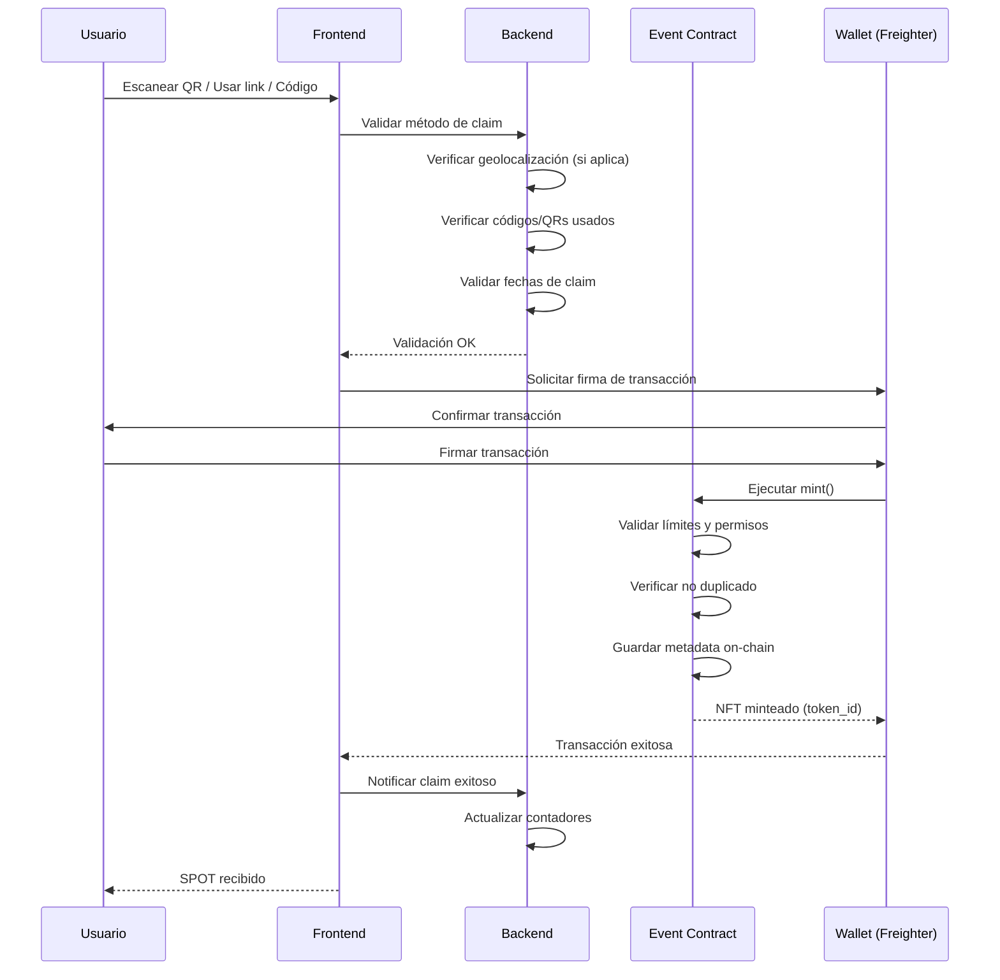
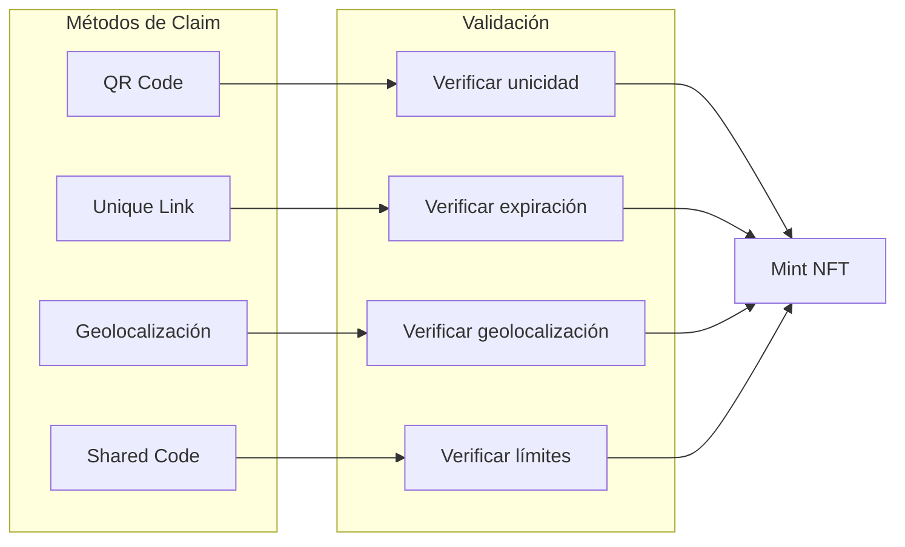
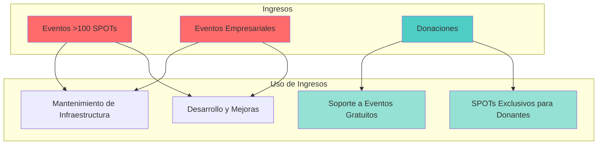
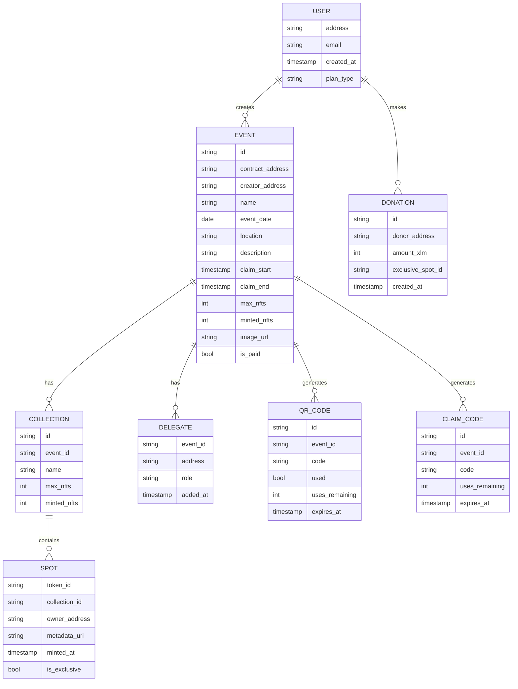

<div align="center">

# 

# 🌟 SPOT
## Stellar Proof of Togetherness

**La plataforma descentralizada de NFTs de asistencia construida sobre Stellar Blockchain**

[](https://stellar.org)
[](https://developers.stellar.org/docs/build/smart-contracts/)
[](https://reactjs.org)
[](https://www.rust-lang.org)
[](https://www.typescriptlang.org/)

---

### 🚀 [Características](#-características-principales) • 🏗️ [Arquitectura](#-arquitectura) • 💰 [Modelo de Negocio](#-modelo-de-negocio) • ⚙️ [Cómo Funciona](#-cómo-funciona) • 🛠️ [Tech Stack](#-tech-stack) • 📦 [Instalación](#-instalación)

</div>

---

## 🎯 ¿Qué es SPOT?

<div align="center">

**SPOT (Stellar Proof of Togetherness)** es la plataforma descentralizada que revoluciona cómo creamos y compartimos recuerdos de eventos. Similar a POAP, pero construido nativamente sobre **Stellar Blockchain** para ofrecer transacciones ultrarrápidas, costos mínimos y una experiencia verdaderamente sostenible.

</div>

### 🌟 ¿Por qué elegir SPOT?

<table>
<tr>
<td width="50%">

#### ⚡ **Rapidez y Economía**
- Transacciones en **3-5 segundos**
- Costos **mínimos** (fracciones de centavo)
- Sin fees exorbitantes

#### 🌍 **Sostenibilidad**
- Consumo energético **99% menor** que otras blockchains
- Tecnología ecológica y eficiente
- Comprometidos con el futuro del planeta

</td>
<td width="50%">

#### 💰 **Escalabilidad**
- Miles de transacciones por segundo
- Sin límites de crecimiento
- Infraestructura robusta y confiable

#### 🔐 **Seguridad**
- Smart contracts auditados
- Verificación inmutable en blockchain
- Sistema de validación dual (on-chain + off-chain)

</td>
</tr>
</table>

### 🎯 ¿Qué problemas resuelve SPOT?

<div align="left">

| Problema | Solución SPOT |
|----------|---------------|
| 🎫 **Crear NFTs de asistencia es complicado** | Interfaz intuitiva, creación en minutos |
| 💸 **Costos altos en otras blockchains** | Transacciones casi gratuitas en Stellar |
| ⏱️ **Tiempos de confirmación largos** | Confirmación en 3-5 segundos |
| 🌱 **Impacto ambiental negativo** | Blockchain sostenible y eficiente |
| 🔗 **Limitado a un método de distribución** | Múltiples métodos: QR, Links, Geolocalización, Códigos |
| 🎨 **No personalizable** | Múltiples colecciones por evento, roles y permisos |

</div>

---

## ✨ Características Principales

### 🎫 Para Organizadores de Eventos

<div align="center">

#### Crea, Gestiona y Distribuye SPOTs con Facilidad

</div>

<table>
<tr>
<td width="33%">

#### 🎨 **Creación Intuitiva**
- Interfaz moderna y fácil de usar
- Formularios guiados paso a paso
- Preview en tiempo real
- Metadata completa del evento

#### 📱 **Múltiples Métodos de Distribución**
- **QR Codes**: Escaneo instantáneo
- **Links Únicos**: Compartibles y con expiración
- **Geolocalización**: Validación por proximidad
- **Códigos Compartidos**: Para eventos masivos

</td>
<td width="33%">

#### 🎯 **Gestión Avanzada**
- Múltiples colecciones por evento
- Sistema de roles granular
- Control de límites de emisión
- Quemado automático de SPOTs no reclamados

#### 🔐 **Control Total**
- Permisos personalizables (Owner, Admin, Minter)
- Gestión de delegados
- Configuración de períodos de claim
- Analytics y métricas en tiempo real

</td>
<td width="33%">

#### 💼 **Planes Flexibles**
- **Gratis**: Hasta 100 SPOTs por evento
- **Pago**: Eventos ilimitados y empresariales
- Sin costos ocultos
- Transparencia total

</td>
</tr>
</table>

---

### 🎁 Para Asistentes

<div align="center">

#### Reclama, Colecciona y Comparte tus SPOTs

</div>

<table>
<tr>
<td width="50%">

#### ⚡ **Claim Instantáneo**
- Un solo clic para reclamar
- Múltiples métodos de acceso
- Sin complicaciones técnicas
- Confirmación en segundos

#### 🖼️ **Galería Personal**
- Visualiza todos tus SPOTs
- Organización por eventos
- Filtros y búsqueda avanzada
- Exporta tu colección

</td>
<td width="50%">

#### 🔗 **Comparte y Verifica**
- Prueba de asistencia inmutable
- Comparte en redes sociales
- Verificación permanente en blockchain
- Integración con Freighter Wallet

#### 🎨 **Experiencia Premium**
- NFTs únicos y coleccionables
- Metadata rica y detallada
- Diseños personalizados
- Historial completo de eventos

</td>
</tr>
</table>

---

### 🔒 Seguridad y Validaciones

<div align="center">

#### Protección Multi-Capa para Máxima Seguridad

</div>

<table>
<tr>
<td>

#### 🛡️ **Validaciones On-Chain**
- ✅ Prevención de duplicados (1 SPOT por wallet)
- ✅ Control de límites de NFTs
- ✅ Validación de períodos de claim
- ✅ Verificación de permisos y roles
- ✅ Ownership verificable

</td>
<td>

#### 🔐 **Validaciones Off-Chain**
- ✅ Verificación de planes y créditos
- ✅ Validación de geolocalización
- ✅ Tracking de códigos/QRs usados
- ✅ Rate limiting anti-spam
- ✅ Validación de pagos

</td>
</tr>
</table>

<div align="center">

**Sistema Híbrido**: Combinamos lo mejor de ambos mundos para ofrecer la máxima seguridad sin comprometer la experiencia de usuario.

</div>

---

## 🏗️ Arquitectura

### Arquitectura General del Sistema



### Estructura de Contratos

SPOT utiliza un patrón Factory para crear instancias de eventos:



### Almacenamiento de Metadata

**Híbrido On-Chain / Off-Chain**:



**Qué se guarda donde**:
- **On-Chain**: Metadata esencial del evento (nombre, fecha, lugar, descripción, URIs) - Verificable e inmutable
- **Off-Chain**: Imágenes de alta resolución - Optimizado para costos

---

## ⚙️ Cómo Funciona

<div align="center">

### Desde la Creación hasta el Claim: Un Flujo Simple y Poderoso

</div>

---

### 🎬 Flujo de Creación de Evento

<div align="center">

**El organizador crea un evento y el sistema despliega automáticamente un contrato inteligente único**

</div>



#### 📋 Pasos del Proceso

<div align="left">

1. **📝 Formulario de Evento**: El organizador completa la información del evento (nombre, fecha, ubicación, descripción)
2. **💰 Verificación de Plan**: El sistema determina automáticamente si el evento es gratuito (≤100 SPOTs) o requiere pago
3. **💳 Procesamiento de Pago** (si aplica): Pago seguro con XLM a través de Stellar Network
4. **🖼️ Subida de Imagen**: La imagen del SPOT se almacena en el servicio de storage
5. **🏭 Despliegue de Contrato**: El Factory Contract crea automáticamente un nuevo Event Contract único
6. **💾 Almacenamiento de Metadata**: La información se guarda tanto on-chain como off-chain
7. **✅ Evento Listo**: El evento está activo y listo para distribuir SPOTs

</div>

---

### 🎁 Flujo de Claim de SPOT

<div align="center">

**El asistente reclama su SPOT usando el método que prefiera**

</div>



#### 🔍 Validaciones en Cada Paso

<table>
<tr>
<td width="50%">

##### **Off-Chain (Backend)**
- ✅ Verifica el plan del organizador
- ✅ Valida códigos/QRs usados
- ✅ Verifica geolocalización (si aplica)
- ✅ Valida fechas de claim
- ✅ Rate limiting anti-spam

</td>
<td width="50%">

##### **On-Chain (Smart Contract)**
- ✅ Verifica que no haya duplicados (1 SPOT por wallet)
- ✅ Valida límites de NFTs
- ✅ Verifica período de claim
- ✅ Valida permisos de roles
- ✅ Garantiza inmutabilidad

</td>
</tr>
</table>

### Métodos de Distribución

SPOT soporta múltiples métodos de distribución, cada uno con sus propias validaciones:



**Características de cada método**:

| Método | Descripción | Validación |
|--------|-------------|------------|
| **QR Code** | Código único escaneable | Un QR puede usarse múltiples veces hasta agotar NFTs disponibles. Una wallet solo puede reclamar 1 vez |
| **Unique Link** | Link único por evento | Expira según configuración del organizador (máximo 1 semana) |
| **Geolocalización** | Validación por proximidad | Radio configurable por el organizador. Validación off-chain |
| **Código Compartido** | Código compartible | Limitado a la cantidad de NFTs creados. Se puede usar hasta agotar |

### Sistema de Permisos y Roles

Control granular de acceso basado en roles:

```mermaid
graph TB
    subgraph "Roles"
        OWNER[Owner]
        ADMIN[Admin]
        MINTER[Minter]
        VIEWER[Viewer]
    end

    subgraph "Permisos Owner"
        O1[Crear evento]
        O2[Eliminar evento]
        O3[Modificar evento]
        O4[Agregar/remover roles]
        O5[Mintear SPOTs]
        O6[Quemar SPOTs]
        OWNER --> O1
        OWNER --> O2
        OWNER --> O3
        OWNER --> O4
        OWNER --> O5
        OWNER --> O6
    end

    subgraph "Permisos Admin"
        A1[Modificar evento]
        A2[Agregar/remover roles]
        A3[Mintear SPOTs]
        A4[Quemar SPOTs]
        ADMIN --> A1
        ADMIN --> A2
        ADMIN --> A3
        ADMIN --> A4
    end

    subgraph "Permisos Minter"
        M1[Mintear SPOTs]
        MINTER --> M1
    end

    subgraph "Permisos Viewer"
        V1[Ver eventos]
        V2[Ver SPOTs]
        VIEWER --> V1
        VIEWER --> V2
    end
```



---

## 💰 Modelo de Negocio

<div align="center">

### Un Modelo Freemium Sostenible y Justo

**Eventos pequeños gratuitos • Eventos grandes con planes flexibles**

</div>

---

### 🆓 Plan Gratuito - Para Todos

<div align="center">

#### **Eventos Personales y Pequeños (Hasta 100 SPOTs)**

**Completamente Gratuito • Sin Tarjeta de Crédito • Sin Límites de Eventos**

</div>

<table>
<tr>
<td width="50%">

#### ✨ **Incluye:**
- ✅ **0 XLM** - Totalmente gratuito
- ✅ **Hasta 100 SPOTs** por evento
- ✅ **Eventos ilimitados**
- ✅ **Métodos**: QR, Links, Códigos compartidos
- ✅ **Metadata básica** almacenada
- ✅ **Período de claim**: Máximo 1 semana

</td>
<td width="50%">

#### 🎯 **Ideal para:**
- 🏠 Eventos personales
- 👥 Meetups pequeños
- 👨‍👩‍👧‍👦 Reuniones familiares
- 🌱 Eventos comunitarios
- 🎓 Clases y talleres pequeños

</td>
</tr>
</table>

---

### 💼 Plan de Pago - Para Eventos Grandes

<div align="center">

#### **Eventos Empresariales y Masivos (Más de 100 SPOTs)**

**Precios Flexibles • Funcionalidades Completas • Soporte Prioritario**

</div>

<table>
<tr>
<td width="50%">

#### 🚀 **Incluye:**
- 💰 **Precio variable** según cantidad de SPOTs
- ♾️ **SPOTs ilimitados** por evento
- 🎯 **Todos los métodos**: QR, Links, Geolocalización, Códigos, NFC
- 📦 **Metadata completa** on-chain
- ⏰ **Período de claim** configurable
- 🎨 **Personalización** completa
- 📞 **Soporte prioritario**

</td>
<td width="50%">

#### 🎯 **Ideal para:**
- 🏢 Conferencias grandes
- 💻 Hackathons masivos
- 🏛️ Eventos corporativos
- 🌐 Plataformas de eventos
- 🎪 Festivales y convenciones

</td>
</tr>
</table>

---

---

### 💝 Sistema de Donaciones

<div align="center">

#### **Apoya el Proyecto y Recibe un SPOT Exclusivo**

**Tu contribución ayuda a mantener SPOT gratuito para eventos pequeños**

</div>

<table>
<tr>
<td width="50%">

#### 🎁 **Beneficios para Donantes:**
- 🎨 **SPOT Exclusivo** de "Donante" automático
- 🏆 **NFT único** y coleccionable
- 💚 **Apoyo a la sostenibilidad** del proyecto
- 🌟 **Reconocimiento** en la comunidad

</td>
<td width="50%">

#### 🔄 **Cómo Funciona:**
1. 💰 El usuario hace una donación en XLM
2. 🎨 El sistema genera automáticamente un SPOT exclusivo
3. 🪙 El SPOT se mintea en la wallet del donante
4. 🚀 Las donaciones financian eventos gratuitos

</td>
</tr>
</table>

### Flujo de Financiamiento



**Modelo Sostenible**:
- Los eventos grandes y empresariales financian la plataforma
- Las donaciones apoyan eventos gratuitos y desarrollo
- Todos los usuarios se benefician de una plataforma robusta y gratuita para uso personal

---

## 🛠️ Tech Stack

### Blockchain Layer

- **Red**: Stellar Network (Futurenet para pruebas, Mainnet para producción)
- **Smart Contracts**: Soroban (Runtime de Stellar)
- **Lenguaje**: Rust
- **SDK**: Soroban SDK v23.0.3+
- **Estándar NFT**: SEP-41 (Stellar Enhancement Proposal 41)
- **Librerías**:
  - `stellar-tokens`: NFTs estándar de Stellar
  - `stellar-access`: Control de acceso y roles
  - `stellar-macros`: Macros para simplificar código

### Frontend Layer

- **Framework**: React 18+ con TypeScript
- **Build Tool**: Vite
- **Wallet**: Freighter Wallet SDK
- **Cliente Stellar**: `@stellar/stellar-sdk` y `soroban-client`
- **Estado**: React Context API
- **Data Fetching**: TanStack Query
- **UI Components**: Stellar Design System
- **Estilos**: Tailwind CSS

### Backend Layer

- **Platform**: Express.js (Node.js/TypeScript)
- **Storage**: Servicio de almacenamiento para imágenes
- **Database**: Base de datos para metadatos de eventos
- **Payment Processing**: Stellar Payments (XLM)

### DevOps

- **CI/CD**: GitHub Actions
- **Testing**: Vitest (frontend), Rust tests (contratos)
- **Deployment**: Servicios de hosting estándar
- **Monitoring**: Analytics y logging

---

## 📦 Instalación

<div align="center">

### Configura SPOT en Minutos

**Sigue estos pasos simples para tener SPOT funcionando en tu máquina**

</div>

---

### 📋 Prerrequisitos

<table>
<tr>
<td width="25%">

#### 🦀 **Rust**
[Descargar](https://www.rust-lang.org/tools/install)
- Latest stable version
- Necesario para contratos

</td>
<td width="25%">

#### 📦 **Node.js**
[Descargar](https://nodejs.org/)
- Versión 22 o superior
- Para frontend y backend

</td>
<td width="25%">

#### ⭐ **Stellar CLI**
[Instalar](https://github.com/stellar/stellar-core)
- Para interactuar con Stellar

</td>
<td width="25%">

#### 🔧 **Scaffold Stellar**
[Instalar](https://github.com/AhaLabs/scaffold-stellar)
- Plugin CLI para desarrollo

</td>
</tr>
</table>

---

### 🚀 Setup Rápido

<div align="left">

#### **1️⃣ Clonar el Repositorio**

```bash
git clone <repo-url>
cd commitsPre
```

#### **2️⃣ Configurar Variables de Entorno**

```bash
cd blockotitos
cp .env.example .env
# Edita .env con tus configuraciones
```

#### **3️⃣ Instalar Dependencias**

```bash
npm install
cd backend && npm install && cd ..
```

#### **4️⃣ Compilar Contratos**

```bash
cargo build --target wasm32v1-none --release
```

#### **5️⃣ Iniciar Desarrollo**

```bash
npm run dev
```

¡Listo! 🎉 La aplicación estará corriendo en `http://localhost:5173`

</div>

---

### ⚙️ Configuración de Entornos

Edita `environments.toml` para configurar tus entornos:

- **Local**: Desarrollo en tu máquina
- **Testnet**: Pruebas en Stellar Testnet
- **Mainnet**: Producción en Stellar Mainnet

---

## 👥 Equipo

SPOT es desarrollado por un equipo apasionado de desarrolladores:

<div align="center">

### Santiago Mesa
**Desarrollo y Smart Contracts / Backend**


[](https://www.linkedin.com/in/santiagomesan)
[](https://t.me/mesas01)
[](https://github.com/mesas01)

---

### Juliana Lugo
**Desarrollo y Diseño**


[](https://www.linkedin.com/in/julianalugo)
[](https://t.me/Julilugo09)
[](https://github.com/Julilugo09)

---

### André Landinez
**Desarrollo y Smart Contracts**


[](https://www.linkedin.com/in/andr%C3%A9-landinez-535298380/)
[](https://t.me/andrethth)
[](https://github.com/andreMD287)

---

### Laura Lizeth Rico
**Diseño y Edición**


[](https://co.linkedin.com/in/lizeth-rico)
[](https://t.me/lricoth)

---

### Sebastian Verduguez
**Redes y Diseño**


[](https://www.linkedin.com/in/sebastian-verduguez-luna-897024319)
[](https://t.me/sebasverduguez)

</div>

---

## 🎨 Decisiones de Diseño

### 1. Arquitectura Híbrida (On-Chain / Off-Chain)

**¿Por qué?**

- **On-Chain**: Metadata esencial (verificable e inmutable)
- **Off-Chain**: Imágenes y datos grandes (optimización de costos)

**Beneficios**:
- ✅ Costos reducidos de almacenamiento en blockchain
- ✅ Verificabilidad completa de metadata esencial
- ✅ Escalabilidad mejorada

### 2. Sistema de Validación Dual

**Validaciones On-Chain**:
- Límites de NFTs
- Prevención de duplicados
- Fechas de claim
- Permisos de roles

**Validaciones Off-Chain**:
- Planes y créditos del usuario
- Geolocalización
- Tracking de códigos/QRs usados
- Rate limiting

**Beneficios**:
- ✅ Seguridad máxima
- ✅ Flexibilidad para lógica compleja
- ✅ Optimización de costos

### 3. Factory Pattern para Contratos

**¿Por qué usar Factory?**

- ✅ Escalabilidad: Cada evento es un contrato independiente
- ✅ Aislamiento: Problemas en un evento no afectan otros
- ✅ Actualización: Posibilidad de mejorar contratos nuevos sin afectar existentes

### 4. Modelo Freemium Sostenible

**¿Por qué eventos pequeños gratuitos?**

- ✅ Accesibilidad: Cualquiera puede crear eventos personales
- ✅ Adopción: Facilita la adopción masiva de la plataforma
- ✅ Sostenibilidad: Eventos grandes financian la infraestructura

### 5. Múltiples Métodos de Distribución

**¿Por qué varios métodos?**

- ✅ Adaptabilidad: Diferentes eventos requieren diferentes métodos
- ✅ Usabilidad: Los usuarios pueden elegir el método más conveniente
- ✅ Flexibilidad: Los organizadores pueden configurar según necesidades

---

## 🗄️ Estructura de Datos

### Modelo de Datos Principal



---

## 🔒 Seguridad y Validaciones

### Capas de Seguridad

```mermaid
graph TB
    subgraph "Validaciones On-Chain"
        V1[Límite de NFTs]
        V2[No duplicados]
        V3[Permisos de roles]
        V4[Fechas de claim]
        V5[Ownership]
    end

    subgraph "Validaciones Off-Chain"
        V6[Plan del usuario]
        V7[Validación de pago]
        V8[Geolocalización]
        V9[Códigos/QRs usados]
        V10[Rate limiting]
    end

    subgraph "Backend Security"
        S1[Authentication]
        S2[JWT Tokens]
        S3[API Rate Limits]
        S4[IP Whitelisting]
    end

    V1 --> CONTRACT[Smart Contract]
    V2 --> CONTRACT
    V3 --> CONTRACT
    V4 --> CONTRACT
    V5 --> CONTRACT

    V6 --> BACKEND[Backend]
    V7 --> BACKEND
    V8 --> BACKEND
    V9 --> BACKEND
    V10 --> BACKEND

    S1 --> BACKEND
    S2 --> BACKEND
    S3 --> BACKEND
    S4 --> BACKEND
```



### Medidas de Seguridad Implementadas

- ✅ **Validación dual**: On-chain + Off-chain
- ✅ **Prevención de duplicados**: Un wallet = 1 SPOT por colección
- ✅ **Rate limiting**: Prevención de spam y ataques
- ✅ **Control de acceso**: Sistema de roles granular
- ✅ **Validación de fechas**: Períodos de claim configurables
- ✅ **Quemado automático**: SPOTs no reclamados se queman automáticamente

---

## 🤝 Contribuir

¡Las contribuciones son bienvenidas! Por favor:

1. Fork el proyecto
2. Crea una rama para tu feature (`git checkout -b feature/AmazingFeature`)
3. Commit tus cambios (`git commit -m 'Add some AmazingFeature'`)
4. Push a la rama (`git push origin feature/AmazingFeature`)
5. Abre un Pull Request

### Guía de Contribución

- Lee nuestro [Código de Conducta](blockotitos/CODE_OF_CONDUCT.md)
- Revisa nuestro [CONTRIBUTING.md](blockotitos/CONTRIBUTING.md)
- Asegúrate de que los tests pasen
- Actualiza la documentación según sea necesario

---

## 🔗 Enlaces Útiles

- [Documentación de Stellar](https://developers.stellar.org/)
- [Documentación de Soroban](https://developers.stellar.org/docs/build/smart-contracts/)
- [Freighter Wallet](https://freighter.app/)
- [Scaffold Stellar](https://github.com/theahaco/scaffold-stellar)

---

---

<div align="center">

## 🌟 ¿Listo para Empezar?

**Únete a la revolución de los NFTs de asistencia en Stellar**

[📦 Instalación](#-instalación) • [📖 Documentación](docs/) • [💬 Comunidad](#-enlaces-útiles) • [🤝 Contribuir](#-contribuir)

---

### 💜 Hecho con ❤️ usando Stellar Blockchain

[](https://github.com/tu-usuario/tu-repo)
[](https://github.com/tu-usuario/tu-repo)
[](https://github.com/tu-usuario/tu-repo/issues)

[⭐ Dános una estrella](https://github.com/tu-usuario/tu-repo) • [🐛 Reportar Bug](https://github.com/tu-usuario/tu-repo/issues) • [💡 Sugerir Feature](https://github.com/tu-usuario/tu-repo/issues)

---

**Última actualización**: Noviembre 2025

</div>
