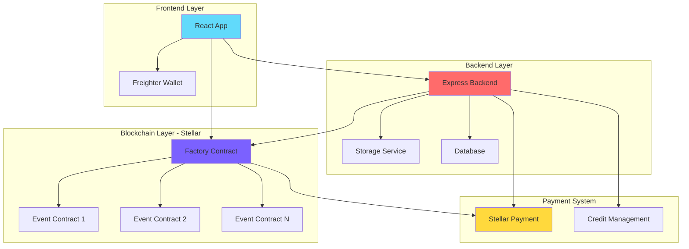
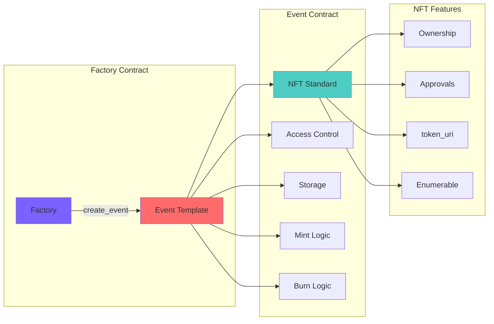
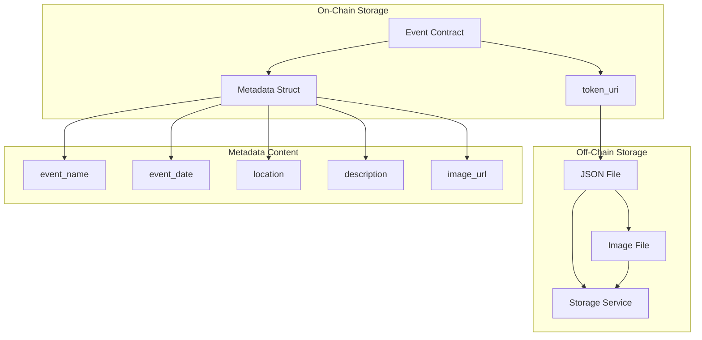
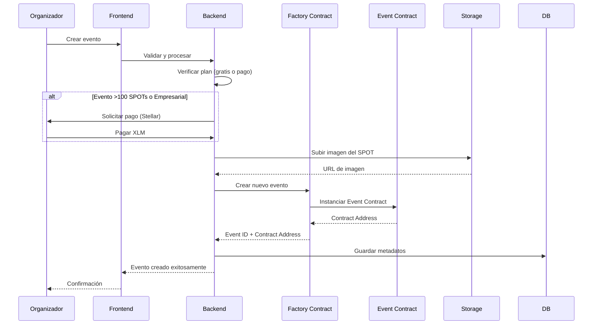
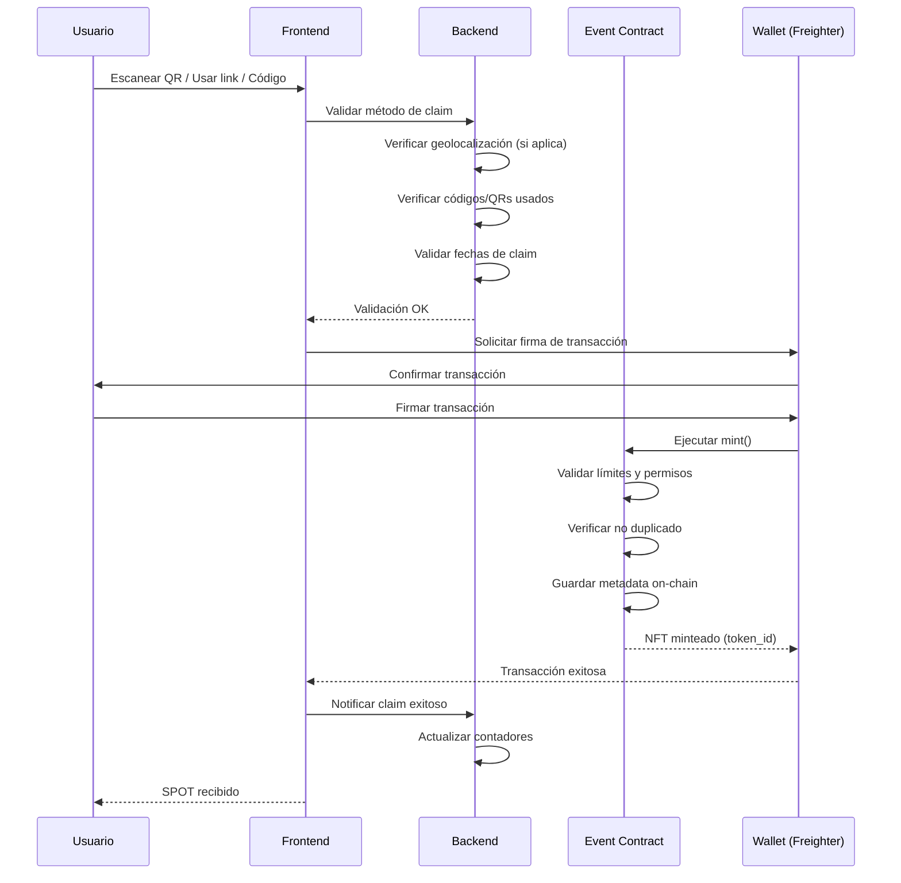
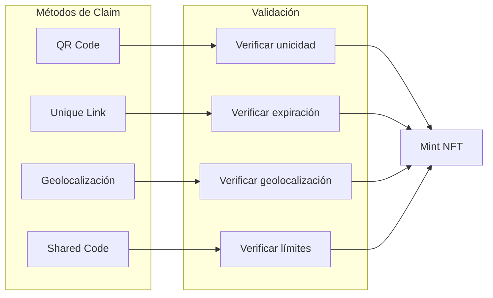
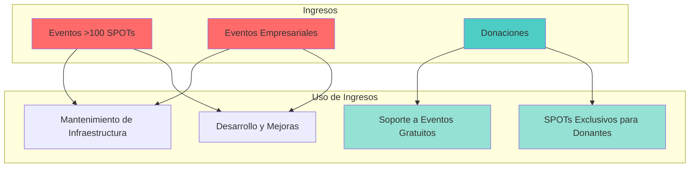
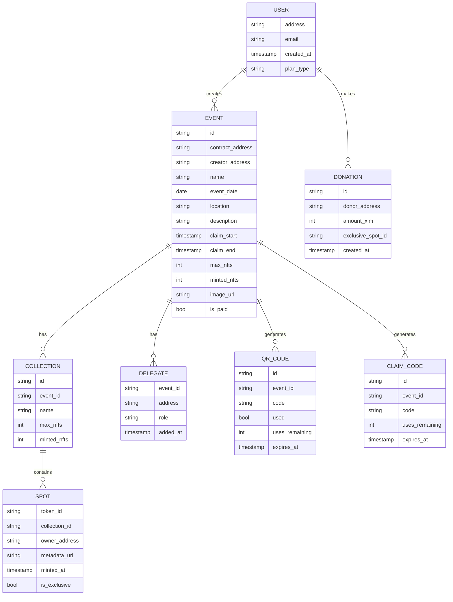

# 🌟 SPOT - Stellar Proof of Togetherness

<div align="center">


**Sistema descentralizado de NFTs de asistencia construido sobre Stellar Blockchain**

[Características](#-características-principales) • [Arquitectura](#-arquitectura) • [Modelo de Negocio](#-modelo-de-negocio) • [Cómo Funciona](#-cómo-funciona) • [Tech Stack](#-tech-stack) • [Instalación](#-instalación)

[](https://stellar.org)
[](https://developers.stellar.org/docs/build/smart-contracts/)
[](https://reactjs.org)
[](https://firebase.google.com)
[](https://www.rust-lang.org)

</div>

---

## 📋 Tabla de Contenidos

- [¿Qué es SPOT?](#-qué-es-spot)
- [Características Principales](#-características-principales)
- [Arquitectura](#-arquitectura)
- [Cómo Funciona](#-cómo-funciona)
- [Modelo de Negocio](#-modelo-de-negocio)
- [Tech Stack](#-tech-stack)
- [Instalación](#-instalación)
- [Equipo](#-equipo)
- [Decisiones de Diseño](#-decisiones-de-diseño)
- [Contribuir](#-contribuir)

---

## 🎯 ¿Qué es SPOT?

**SPOT (Stellar Proof of Togetherness)** es una plataforma descentralizada que permite crear y distribuir NFTs de asistencia a eventos, similar a POAP de Ethereum, pero construido nativamente sobre la red Stellar.

### ¿Por qué Stellar?

- ⚡ **Transacciones rápidas y económicas**: Stellar procesa transacciones en 3-5 segundos con costos mínimos
- 🌍 **Sostenible**: Consumo energético extremadamente bajo comparado con otras blockchains
- 💰 **Escalable**: Capaz de manejar miles de transacciones por segundo
- 🔐 **Seguro**: Smart contracts auditados y verificables en la blockchain

### ¿Qué resuelve SPOT?

SPOT permite a organizadores de eventos:
- ✅ Crear NFTs únicos de asistencia fácilmente
- ✅ Distribuir SPOTs mediante múltiples métodos (QR, Links, Códigos, Geolocalización)
- ✅ Verificar asistencia de forma inmutable en la blockchain
- ✅ Crear múltiples colecciones por evento (Asistente, Ganador, Mentor, etc.)
- ✅ Gestionar roles y permisos de forma descentralizada

---

## ✨ Características Principales

### 🎫 Para Organizadores

- **Creación de Eventos**: Interfaz intuitiva para crear eventos con toda su metadata
- **Múltiples Métodos de Distribución**:
  - 📱 **QR Codes**: Escaneo y claim inmediato
  - 🔗 **Links Únicos**: Links compartibles con expiración configurable
  - 📍 **Geolocalización**: Validación por proximidad
  - 🔑 **Códigos Compartidos**: Códigos especiales para eventos masivos
- **Múltiples Colecciones**: Un evento puede tener varias colecciones de SPOTs
- **Sistema de Roles**: Control granular de permisos (Owner, Admin, Minter)
- **Gestión de Límites**: Controla cuántos SPOTs se pueden emitir
- **Quemado Automático**: Los SPOTs no reclamados se queman automáticamente

### 🎁 Para Asistentes

- **Claim Fácil**: Reclama tu SPOT con un solo clic
- **Galería Personal**: Visualiza todos tus SPOTs en un solo lugar
- **Verificación Permanente**: Prueba de asistencia inmutable en la blockchain
- **Compartible**: Comparte tus SPOTs en redes sociales
- **Wallet Integration**: Usa Freighter Wallet para gestionar tus SPOTs

### 🔒 Seguridad y Validaciones

- **Prevención de Duplicados**: Un wallet solo puede tener 1 SPOT por colección
- **Validación de Fechas**: Períodos de claim configurables (máximo 1 semana)
- **Control de Límites**: Validación tanto on-chain como off-chain
- **Sistema Híbrido**: Validaciones en blockchain + backend para máxima seguridad

---

## 🏗️ Arquitectura

### Arquitectura General del Sistema



### Estructura de Contratos

SPOT utiliza un patrón Factory para crear instancias de eventos:



### Almacenamiento de Metadata

**Híbrido On-Chain / Off-Chain**:



**Qué se guarda donde**:
- **On-Chain**: Metadata esencial del evento (nombre, fecha, lugar, descripción, URIs) - Verificable e inmutable
- **Off-Chain**: Imágenes de alta resolución - Optimizado para costos

---

## 🔄 Cómo Funciona

### Flujo de Creación de Evento

El organizador crea un evento y el sistema despliega un contrato inteligente:



**Pasos detallados**:
1. El organizador completa el formulario de creación de evento
2. El sistema determina si el evento es gratuito o requiere pago
3. Si requiere pago (>100 SPOTs o empresarial), se procesa el pago con XLM
4. La imagen del SPOT se sube al servicio de almacenamiento
5. El Factory Contract despliega un nuevo Event Contract
6. La metadata se guarda en la base de datos para indexación
7. El evento está listo para distribuir SPOTs

### Flujo de Claim de SPOT

El asistente reclama su SPOT usando uno de los métodos disponibles:



**Validaciones en cada paso**:

1. **Off-Chain (Backend)**:
   - ✅ Verifica el plan del organizador
   - ✅ Valida códigos/QRs usados
   - ✅ Verifica geolocalización (si aplica)
   - ✅ Valida fechas de claim

2. **On-Chain (Smart Contract)**:
   - ✅ Verifica que no haya duplicados (1 SPOT por wallet)
   - ✅ Valida límites de NFTs
   - ✅ Verifica período de claim
   - ✅ Valida permisos de roles

### Métodos de Distribución

SPOT soporta múltiples métodos de distribución, cada uno con sus propias validaciones:



**Características de cada método**:

| Método | Descripción | Validación |
|--------|-------------|------------|
| **QR Code** | Código único escaneable | Un QR puede usarse múltiples veces hasta agotar NFTs disponibles. Una wallet solo puede reclamar 1 vez |
| **Unique Link** | Link único por evento | Expira según configuración del organizador (máximo 1 semana) |
| **Geolocalización** | Validación por proximidad | Radio configurable por el organizador. Validación off-chain |
| **Código Compartido** | Código compartible | Limitado a la cantidad de NFTs creados. Se puede usar hasta agotar |

### Sistema de Permisos y Roles

Control granular de acceso basado en roles:

```mermaid
graph TB
    subgraph "Roles"
        OWNER[Owner]
        ADMIN[Admin]
        MINTER[Minter]
        VIEWER[Viewer]
    end

    subgraph "Permisos Owner"
        O1[Crear evento]
        O2[Eliminar evento]
        O3[Modificar evento]
        O4[Agregar/remover roles]
        O5[Mintear SPOTs]
        O6[Quemar SPOTs]
        OWNER --> O1
        OWNER --> O2
        OWNER --> O3
        OWNER --> O4
        OWNER --> O5
        OWNER --> O6
    end

    subgraph "Permisos Admin"
        A1[Modificar evento]
        A2[Agregar/remover roles]
        A3[Mintear SPOTs]
        A4[Quemar SPOTs]
        ADMIN --> A1
        ADMIN --> A2
        ADMIN --> A3
        ADMIN --> A4
    end

    subgraph "Permisos Minter"
        M1[Mintear SPOTs]
        MINTER --> M1
    end

    subgraph "Permisos Viewer"
        V1[Ver eventos]
        V2[Ver SPOTs]
        VIEWER --> V1
        VIEWER --> V2
    end
```



---

## 💰 Modelo de Negocio

### Estructura de Precios

SPOT utiliza un modelo **freemium** con opciones de pago para eventos grandes y empresariales:

#### 🆓 Eventos Gratuitos (Personales y Pequeños)

Los eventos **personales y pequeños** (hasta 100 SPOTs) son **completamente gratuitos**:

| Característica | Valor |
|----------------|-------|
| **Precio** | 0 XLM |
| **Límite de SPOTs** | Hasta 100 SPOTs por evento |
| **Eventos** | Ilimitados |
| **Métodos disponibles** | QR, Link, Códigos compartidos |
| **Almacenamiento** | Metadata básica |
| **Período de claim** | Máximo 1 semana |

**Ideal para**: Eventos personales, meetups pequeños, reuniones familiares, eventos comunitarios

---

#### 💼 Eventos de Pago (Grandes y Empresariales)

Los eventos que **exceden 100 SPOTs** o son de **naturaleza empresarial** requieren pago:

| Característica | Valor |
|----------------|-------|
| **Precio** | Variable según cantidad de SPOTs |
| **Límite de SPOTs** | Ilimitados |
| **Eventos** | Ilimitados |
| **Métodos disponibles** | Todos (QR, Link, Geolocalización, Códigos, NFC) |
| **Almacenamiento** | Metadata completa on-chain |
| **Período de claim** | Configurable |
| **Soporte** | Prioridad |
| **Personalización** | APIs custom, branding, integraciones |

**Ideal para**: Conferencias grandes, hackathons, eventos corporativos, plataformas de eventos

---

### 💝 Sistema de Donaciones

**Las personas pueden donar y recibir un SPOT exclusivo**:

- ✅ **Donaciones**: Cualquier persona puede hacer una donación en XLM
- ✅ **SPOT Exclusivo**: Los donantes reciben automáticamente un SPOT especial de "Donante"
- ✅ **Sostenibilidad**: Las donaciones ayudan a mantener la plataforma gratuita para eventos pequeños
- ✅ **Reconocimiento**: Los SPOTs de donante son únicos y coleccionables

**Cómo funciona**:
1. El usuario hace una donación desde la plataforma
2. El sistema genera automáticamente un SPOT exclusivo de "Donante"
3. El SPOT se mintea directamente en la wallet del donante
4. Las donaciones se utilizan para mantener la infraestructura y soportar eventos gratuitos

### Flujo de Financiamiento



**Modelo Sostenible**:
- Los eventos grandes y empresariales financian la plataforma
- Las donaciones apoyan eventos gratuitos y desarrollo
- Todos los usuarios se benefician de una plataforma robusta y gratuita para uso personal

---

## 🛠️ Tech Stack

### Blockchain Layer

- **Red**: Stellar Network (Futurenet para pruebas, Mainnet para producción)
- **Smart Contracts**: Soroban (Runtime de Stellar)
- **Lenguaje**: Rust
- **SDK**: Soroban SDK v23.0.3+
- **Estándar NFT**: SEP-41 (Stellar Enhancement Proposal 41)
- **Librerías**:
  - `stellar-tokens`: NFTs estándar de Stellar
  - `stellar-access`: Control de acceso y roles
  - `stellar-macros`: Macros para simplificar código

### Frontend Layer

- **Framework**: React 18+ con TypeScript
- **Build Tool**: Vite
- **Wallet**: Freighter Wallet SDK
- **Cliente Stellar**: `@stellar/stellar-sdk` y `soroban-client`
- **Estado**: React Context API
- **Data Fetching**: TanStack Query
- **UI Components**: Stellar Design System
- **Estilos**: Tailwind CSS

### Backend Layer

- **Platform**: Express.js (Node.js/TypeScript)
- **Storage**: Servicio de almacenamiento para imágenes
- **Database**: Base de datos para metadatos de eventos
- **Payment Processing**: Stellar Payments (XLM)

### DevOps

- **CI/CD**: GitHub Actions
- **Testing**: Vitest (frontend), Rust tests (contratos)
- **Deployment**: Servicios de hosting estándar
- **Monitoring**: Analytics y logging

---

## 📦 Instalación

### Prerrequisitos

- [Rust](https://www.rust-lang.org/tools/install) (latest stable)
- [Node.js](https://nodejs.org/) v22+
- [Stellar CLI](https://github.com/stellar/stellar-core)
- [Scaffold Stellar CLI Plugin](https://github.com/AhaLabs/scaffold-stellar)

### Setup del Proyecto

```bash
# 1. Clonar el repositorio
git clone <repo-url>
cd commitsPre

# 2. Configurar variables de entorno
cd blockotitos
cp .env.example .env
# Editar .env con tus configuraciones

# 3. Instalar dependencias del frontend
npm install

# 4. Compilar contratos
cargo build --target wasm32v1-none --release

# 5. Iniciar entorno de desarrollo
npm run dev
```

### Configuración de Entornos

Edita `environments.toml` para configurar tus entornos (local, testnet, mainnet).

---

## 👥 Equipo

SPOT es desarrollado por un equipo apasionado de desarrolladores:

<div align="center">

### Santiago Mesa
**Desarrollo y Smart Contracts / Backend**


[](https://www.linkedin.com/in/santiagomesan)
[](https://t.me/mesas01)
[](https://github.com/mesas01)

---

### Juliana Lugo
**Desarrollo y Diseño**


[](https://www.linkedin.com/in/julianalugo)
[](https://t.me/Julilugo09)
[](https://github.com/Julilugo09)

---

### André Landinez
**Desarrollo y Smart Contracts**


[](https://www.linkedin.com/in/andr%C3%A9-landinez-535298380/)
[](https://t.me/andrethth)
[](https://github.com/andreMD287)

---

### Laura Lizeth Rico
**Diseño y Edición**


[](https://co.linkedin.com/in/lizeth-rico)
[](https://t.me/lricoth)

---

### Sebastian Verduguez
**Redes y Diseño**


[](https://www.linkedin.com/in/sebastian-verduguez-luna-897024319)
[](https://t.me/sebasverduguez)

</div>

---

## 🎨 Decisiones de Diseño

### 1. Arquitectura Híbrida (On-Chain / Off-Chain)

**¿Por qué?**

- **On-Chain**: Metadata esencial (verificable e inmutable)
- **Off-Chain**: Imágenes y datos grandes (optimización de costos)

**Beneficios**:
- ✅ Costos reducidos de almacenamiento en blockchain
- ✅ Verificabilidad completa de metadata esencial
- ✅ Escalabilidad mejorada

### 2. Sistema de Validación Dual

**Validaciones On-Chain**:
- Límites de NFTs
- Prevención de duplicados
- Fechas de claim
- Permisos de roles

**Validaciones Off-Chain**:
- Planes y créditos del usuario
- Geolocalización
- Tracking de códigos/QRs usados
- Rate limiting

**Beneficios**:
- ✅ Seguridad máxima
- ✅ Flexibilidad para lógica compleja
- ✅ Optimización de costos

### 3. Factory Pattern para Contratos

**¿Por qué usar Factory?**

- ✅ Escalabilidad: Cada evento es un contrato independiente
- ✅ Aislamiento: Problemas en un evento no afectan otros
- ✅ Actualización: Posibilidad de mejorar contratos nuevos sin afectar existentes

### 4. Modelo Freemium Sostenible

**¿Por qué eventos pequeños gratuitos?**

- ✅ Accesibilidad: Cualquiera puede crear eventos personales
- ✅ Adopción: Facilita la adopción masiva de la plataforma
- ✅ Sostenibilidad: Eventos grandes financian la infraestructura

### 5. Múltiples Métodos de Distribución

**¿Por qué varios métodos?**

- ✅ Adaptabilidad: Diferentes eventos requieren diferentes métodos
- ✅ Usabilidad: Los usuarios pueden elegir el método más conveniente
- ✅ Flexibilidad: Los organizadores pueden configurar según necesidades

---

## 🗄️ Estructura de Datos

### Modelo de Datos Principal



---

## 🔒 Seguridad y Validaciones

### Capas de Seguridad

```mermaid
graph TB
    subgraph "Validaciones On-Chain"
        V1[Límite de NFTs]
        V2[No duplicados]
        V3[Permisos de roles]
        V4[Fechas de claim]
        V5[Ownership]
    end

    subgraph "Validaciones Off-Chain"
        V6[Plan del usuario]
        V7[Validación de pago]
        V8[Geolocalización]
        V9[Códigos/QRs usados]
        V10[Rate limiting]
    end

    subgraph "Backend Security"
        S1[Authentication]
        S2[JWT Tokens]
        S3[API Rate Limits]
        S4[IP Whitelisting]
    end

    V1 --> CONTRACT[Smart Contract]
    V2 --> CONTRACT
    V3 --> CONTRACT
    V4 --> CONTRACT
    V5 --> CONTRACT

    V6 --> BACKEND[Backend]
    V7 --> BACKEND
    V8 --> BACKEND
    V9 --> BACKEND
    V10 --> BACKEND

    S1 --> BACKEND
    S2 --> BACKEND
    S3 --> BACKEND
    S4 --> BACKEND
```



### Medidas de Seguridad Implementadas

- ✅ **Validación dual**: On-chain + Off-chain
- ✅ **Prevención de duplicados**: Un wallet = 1 SPOT por colección
- ✅ **Rate limiting**: Prevención de spam y ataques
- ✅ **Control de acceso**: Sistema de roles granular
- ✅ **Validación de fechas**: Períodos de claim configurables
- ✅ **Quemado automático**: SPOTs no reclamados se queman automáticamente

---

## 🤝 Contribuir

¡Las contribuciones son bienvenidas! Por favor:

1. Fork el proyecto
2. Crea una rama para tu feature (`git checkout -b feature/AmazingFeature`)
3. Commit tus cambios (`git commit -m 'Add some AmazingFeature'`)
4. Push a la rama (`git push origin feature/AmazingFeature`)
5. Abre un Pull Request

### Guía de Contribución

- Lee nuestro [Código de Conducta](blockotitos/CODE_OF_CONDUCT.md)
- Revisa nuestro [CONTRIBUTING.md](blockotitos/CONTRIBUTING.md)
- Asegúrate de que los tests pasen
- Actualiza la documentación según sea necesario

---

## 🔗 Enlaces Útiles

- [Documentación de Stellar](https://developers.stellar.org/)
- [Documentación de Soroban](https://developers.stellar.org/docs/build/smart-contracts/)
- [Freighter Wallet](https://freighter.app/)
- [Scaffold Stellar](https://github.com/theahaco/scaffold-stellar)

---

<div align="center">

**Hecho con ❤️ usando Stellar Blockchain**

[⭐ Dános una estrella](https://github.com/tu-usuario/tu-repo) • [🐛 Reportar Bug](https://github.com/tu-usuario/tu-repo/issues) • [💡 Sugerir Feature](https://github.com/tu-usuario/tu-repo/issues)

</div>

---

**Última actualización**: Noviembre 2025
