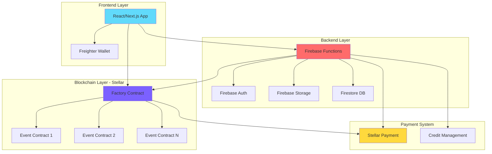
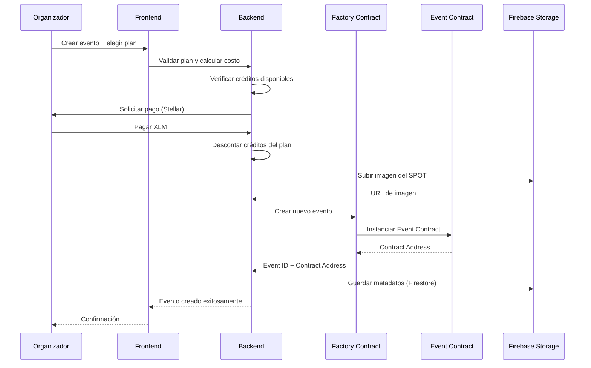
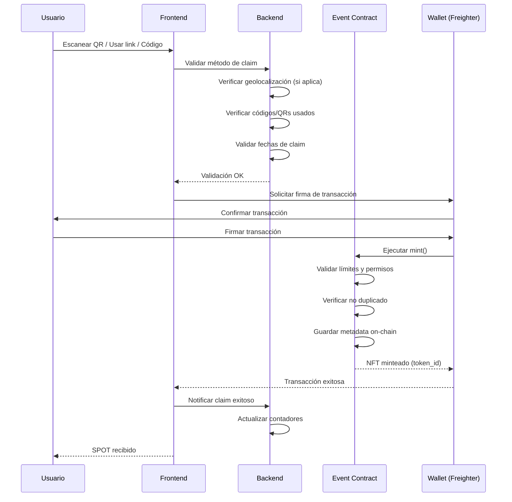
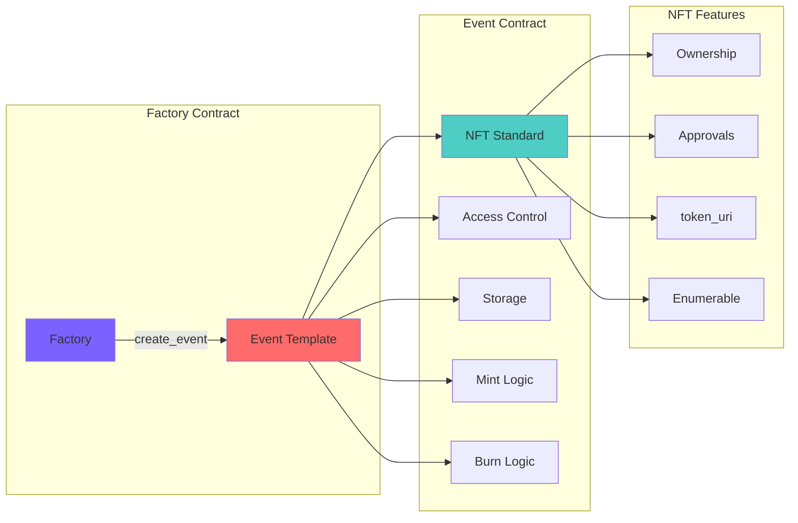
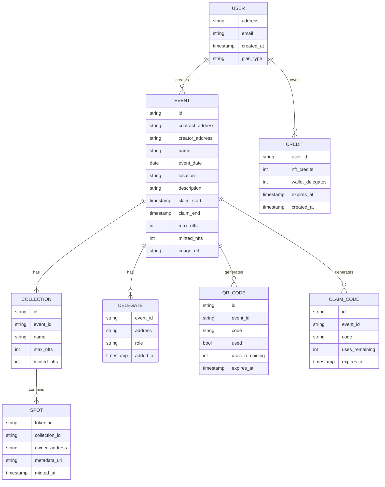
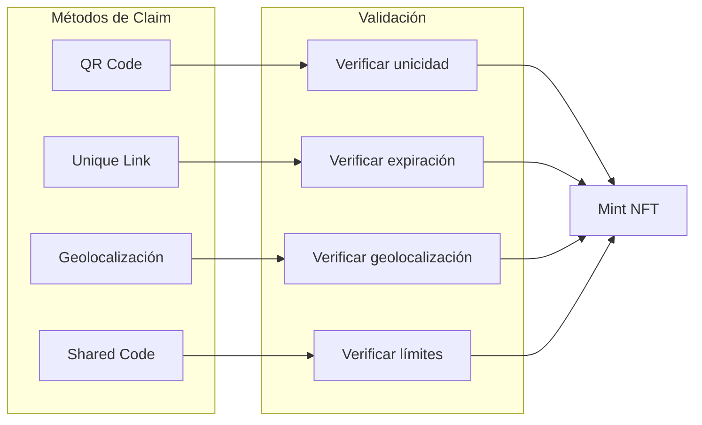
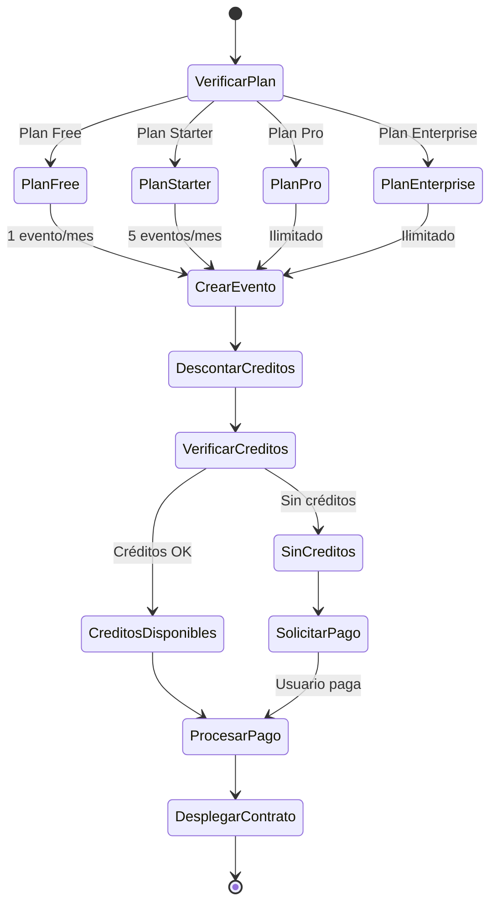
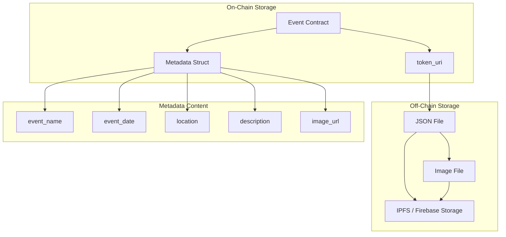

# Arquitectura del Sistema SPOT (Stellar Proof of Togetherness)

## Diagrama de Arquitectura General

## Flujo de Creación de Evento

## Flujo de Claim de SPOT

## Estructura de Contratos

## Estructura de Datos

## Sistema de Permisos y Roles

```mermaid
graph TB
    subgraph "Roles"
        OWNER[Owner]
        ADMIN[Admin]
        MINTER[Minter]
        VIEWER[Viewer]
    end

    subgraph "Permisos Owner"
        O1[Crear evento]
        O2[Eliminar evento]
        O3[Modificar evento]
        O4[Agregar/remover roles]
        O5[Mintear SPOTs]
        O6[Quemar SPOTs]
        OWNER --> O1
        OWNER --> O2
        OWNER --> O3
        OWNER --> O4
        OWNER --> O5
        OWNER --> O6
    end

    subgraph "Permisos Admin"
        A1[Modificar evento]
        A2[Agregar/remover roles]
        A3[Mintear SPOTs]
        A4[Quemar SPOTs]
        ADMIN --> A1
        ADMIN --> A2
        ADMIN --> A3
        ADMIN --> A4
    end

    subgraph "Permisos Minter"
        M1[Mintear SPOTs]
        MINTER --> M1
    end

    subgraph "Permisos Viewer"
        V1[Ver eventos]
        V2[Ver SPOTs]
        VIEWER --> V1
        VIEWER --> V2
    end
```

## Métodos de Distribución

## Sistema de Créditos y Planes

## Arquitectura de Metadata

## Seguridad y Validaciones

```mermaid
graph TB
    subgraph "Validaciones On-Chain"
        V1[Límite de NFTs]
        V2[No duplicados]
        V3[Permisos de roles]
        V4[Fechas de claim]
        V5[Ownership]
    end

    subgraph "Validaciones Off-Chain"
        V6[Plan del usuario]
        V7[Créditos disponibles]
        V8[Geolocalización]
        V9[Códigos/QRs usados]
        V10[Rate limiting]
    end

    subgraph "Backend Security"
        S1[Firebase Auth]
        S2[JWT Tokens]
        S3[API Rate Limits]
        S4[IP Whitelisting]
    end

    V1 --> CONTRACT[Smart Contract]
    V2 --> CONTRACT
    V3 --> CONTRACT
    V4 --> CONTRACT
    V5 --> CONTRACT

    V6 --> BACKEND[Backend]
    V7 --> BACKEND
    V8 --> BACKEND
    V9 --> BACKEND
    V10 --> BACKEND

    S1 --> BACKEND
    S2 --> BACKEND
    S3 --> BACKEND
    S4 --> BACKEND
```

